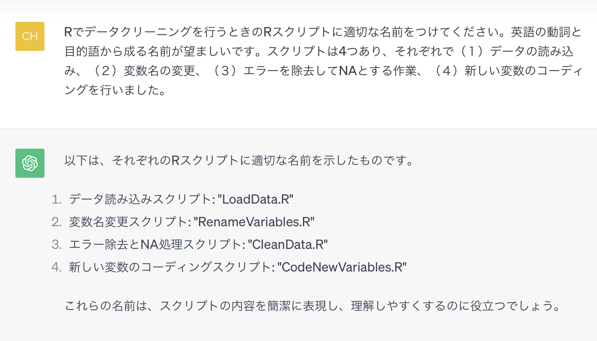
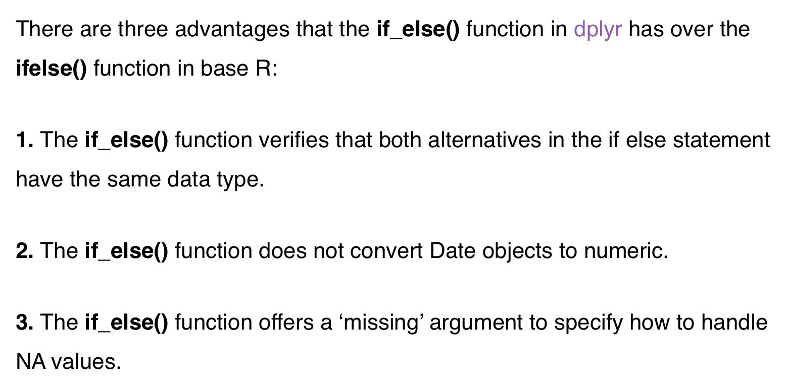
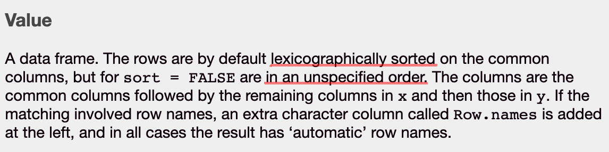

<style type="text/css">
code, pre {
  color: #484848;
}
</style>

```{r setup, include=FALSE}
knitr::opts_chunk$set(echo = FALSE)
```

```{r execute R codes, include=FALSE}
# source(here::here("code/main/run_all.R"))
# source(here::here("code/GroupA/run_all.R"))
# source(here::here("code/GroupB/run_all.R"))
# source(here::here("code/GroupCD/run_all.R"))

```

# 課題設定の背景

## 社会科学分野における"再現性"への注目

  - ここでの再現性 = Reproducibility <br/> (著者のデータ・コードを用いて同じ結果が再現できること)

    - 論文投稿時にコードやデータを含めたReplication Packageを求められることも
    
  - 最近の関連イベント
        
    - RAブートキャンプの論文レプリケーション
    - Vilhuber教授の日本経済学会での講演含む「実証論文レプリケーション ワークショップシリーズ」
    - 労働経済学カンファレンス チュートリアルセッション「研究プロジェクトの管理法」（阪大・北村先生）
    
    
## 中室研の活動における"再現性"

  - 発表スライドの結果はコードから再現できているのか
  
  - RAのコードはRPに含められるものになっているか
      
  - 記述統計の回での報告内容はカンファ前にも再現できるか
  
  - カンファ前に誰か（ゼミ生や教員）に助けを求めたときに、その人は同じ結果を再現できるか
 
    
- **コードやデータは公表することを前提として管理しよう**
- **将来の自分や他人が助かる整理の仕方を身につけよう**


## 中室研でよくあるつまずきポイント

- データクリーニングがうまくできていないことが記述統計の回で発覚する

    - 計量経済学の教科書のプログラミング課題などと異なり、データクリーニングからを課題に

- 記述統計や推計の図表が、基本的な書き方に従っていないので伝わらない

    - Rスクリプトの中で図表をアウトプットするよう問題設定
    
- 交差項を入れた推定の意味がわかっていない

    - 解釈までを課題に

# 講評

## コードへのコメント

- `run_all.R`を実行して、エラーで止まった班はありませんでした（拍手）

- 全ての班から提出されたコード・廣瀬さんのコード（先ほどの解答例）・井上のコードを別で共有します

    - 良い方法を真似してみましょう


## 1. 警告メッセージを無視しない
```{r include=F}
all_data <- readRDS(here::here("data/clean/GroupA/all_data.rds"))
```

A班 `All_data.R` 28行目から
```{r error message, echo = T}

# estimate ---------------------------------------------------------

model_A <- lm(scaled_score ~ treatment_dummy,all_data)
model_B <- lm(scaled_score ~ treatment_dummy + age + female_dummy +
                temporary + upper50_dummy + bottom0_25dummy + 
                bottom25_50dummy + upper0_25dummy + grade_rank_percent,
              all_data,cluster="school_ID")
```

- `lm()`ではクラスターを指定できないので、オプションを無視する旨のメッセージが出ている

## 2. 命名ルールの見直し

B班 `data_cleaning.R` 8行目から
```{r naming1, eval=FALSE, echo = T}
# Clean df_student
df_student <- df_student %>%
  mutate(
    grade = replace(grade, grade %in% c("999", "*"), NA),
    grade_group4 = replace(grade_group4, grade_group4 == "###", NA),
    grade_group2 = replace(grade_group2, grade_group2 == "###", NA),
```

- 教育の文脈では、成績の意味で`grade`を用いるのは避けたい

## 2. 命名ルールの見直し

CD班 `run_all.R`
```{r naming2, eval=FALSE, echo = T}
source("code/setup.R")
source("code/read_data.R")
source("code/change_variable.R")
source("code/NAcoding.R")
source("code/data_join.R")
source("code/data_cleaned.R")
source("code/describe.R")
source("code/estimate.R")
```

- `change_variable.R` が何をするのかわかりにくい
- `data_cleaned.R`（名詞）はデータそのもののように感じる

## 2. ChatGPTによる提案

```{r out.width="100%"}

```


## 3.  `base`と`tidyverse`どちらを用いるか

CD班 `NAcoding.R`
```{r tidyverse, eval = F, echo = T}
         gender = ifelse(gender == "unknown", NA, 
                         gender),
         score_order_2 = ifelse(score_order_2 == "###" , NA , 
                                score_order_2),
         score_order_4 = ifelse(score_order_4 == "###" , NA , 
                                score_order_4),
```

- `base::ifelse()`と`dplyr::if_else()`は異なる関数なのでアンダースコアの有無にも注意を払うこと
- `base`でできることの多くは`tidyverse`でもできる（その逆も）（https://marcyshieh.com/ps811-materials/base-r-vs-tidyverse.html）
- 可読性の観点とdata wranglingにおいてでは`tidyverse`に優位があるのではないか

## 3. `tidyverse`の優位がある場面

```{r out.width="100%"}

```

(https://www.statology.org/r-if_else-vs-ifelse/)

## 3. `tidyverse`の優位がある場面
井上が自分の研究で嵌った罠

- `base::merge`のヘルプ

```{r out.width="100%"}

```


- データフレームに直して`dplyr::left_join`で接続しました

# まとめ

## まとめ

- お疲れ様でした

- 皆さんの学びはまとめて共有します

- 進行に関して建設的なフィードバックありがとうございました

    - 実施そのものに関しては好意的なものが多かったです
    - フィードバックは次回以降の参考として残します
    
- （おまけ）このスライドはRmarkdownで作成しました

- 今学期も頑張りましょう
